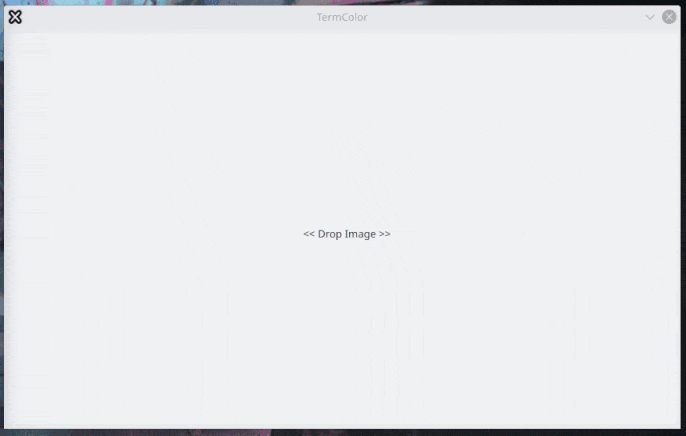

# TermColor

[](https://travis-ci.org/belijzajac/TermColor)
[](https://www.codacy.com/gh/belijzajac/TermColor/dashboard?utm_source=github.com&amp;utm_medium=referral&amp;utm_content=belijzajac/TermColor&amp;utm_campaign=Badge_Grade)
[](LICENSE)



[YouTube link](https://youtu.be/QqSbcSTW530)

## About

Effortlessly generate color-schemes for terminal emulators by a drop of a picture, powered by modern C++17, Qt5 framework, and OpenCV library. Notable features:

*   Uses the K-means clustering algorithm to accurately identify dominant colors in an image
*   Takes mere seconds for a color-scheme to appear in the terminal emulator

### Supported terminal emulators

*   Konsole (KDE)
*   Xfce4 Terminal (Xfce4)
*   LXTerminal (LXDE)
*   JSON (save the color-scheme to a file)

[Status](STATUS.md)

## Dependencies

*   OpenCV >= 3.2.0 (recommended: **3.4.2**)
*   Qt5 >= 5.9.5
*   CMake >= 3.13
*   g++ (preferably version 9.2.1)

For Debian (stable/__testing__/__sid__), the following packages should be enough:

```bash
qt5-default
zlib1g-dev
cmake
g++
```

## Obtaining OpenCV

### Building from source

Copy-paste the following commands as root:

```bash
# Required packages
apt install unzip wget cmake g++

# Download OpenCV (you can as well execute wget from your ~/Downloads foler)
wget https://github.com/opencv/opencv/archive/3.4.2.zip -O opencv-3.4.2.zip

# Extract archive
unzip opencv-3.4.2.zip && rm opencv-3.4.2.zip
cd opencv-3.4.2 && mkdir build && cd build

# Build OpenCV
cmake -D CMAKE_BUILD_TYPE=RELEASE -D CMAKE_INSTALL_PREFIX=/usr/local ..
make -j $(nproc)
make install
```

## Ubuntu

The project builds successfully on Ubuntu 19.04, however, for the g++ (the C++ compiler), install the package `g++-9`. See the [Issue #9](https://github.com/belijzajac/TermColor/issues/9) for a detailed workaround

## Arch Linux

As one person has pointed out, you need `opencv3-opt` from the AUR in order to build TermColor properly

## Building

``` Shell
git clone https://github.com/belijzajac/TermColor.git
cd TermColor
git submodule update --init --recursive
mkdir build && cd build
cmake ..
make TermColor
```

## Running

``` Shell
cd src
./TermColor
```

## License

This project is available under the MIT License. See the LICENSE file for more info.
